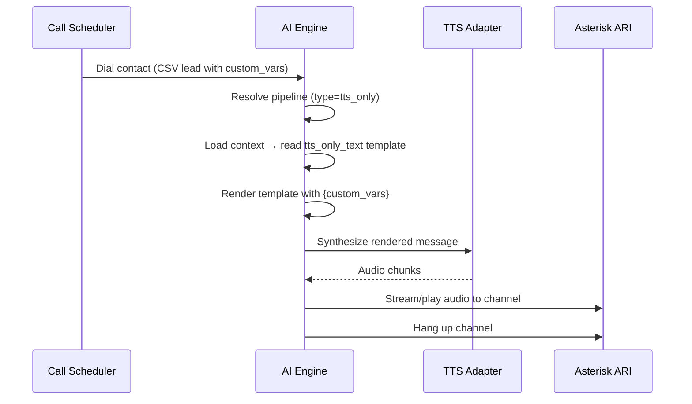

# TTS-Only Broadcast Pipeline — Walkthrough

## Summary

Added a new **TTS-only pipeline type** for outbound broadcast campaigns. When a call uses this pipeline, the engine renders a personalized message template using CSV custom variables, plays it via TTS, and automatically hangs up — no STT or LLM processing involved.

## Files Modified (7) + Tests (1)

| File | Change |
|------|--------|
| [config.py](file:///Users/ivangarcia/Repositories/AVA-AI-Voice-Agent-for-Asterisk/src/config.py) | `PipelineEntry`: added `type` field, made `stt`/`llm` optional, added `is_tts_only` property |
| [orchestrator.py](file:///Users/ivangarcia/Repositories/AVA-AI-Voice-Agent-for-Asterisk/src/pipelines/orchestrator.py) | Added `NoOpSTTAdapter`, `NoOpLLMAdapter`, registered `none_stt`/`none_llm` factories, added `is_tts_only` to `PipelineResolution` |
| [normalization.py](file:///Users/ivangarcia/Repositories/AVA-AI-Voice-Agent-for-Asterisk/src/config/normalization.py) | `normalize_pipelines()` handles `tts_only` type, `validate_pipelines()` skips suffix checks for NoOp components |
| [transport_orchestrator.py](file:///Users/ivangarcia/Repositories/AVA-AI-Voice-Agent-for-Asterisk/src/core/transport_orchestrator.py) | `ContextConfig`: added `tts_only_text` and `auto_hangup_after_tts` fields |
| [engine.py](file:///Users/ivangarcia/Repositories/AVA-AI-Voice-Agent-for-Asterisk/src/engine.py) | Added `_render_tts_only_template()` and TTS-only broadcast flow (template → synth → play → hangup) |
| [PipelineForm.tsx](file:///Users/ivangarcia/Repositories/AVA-AI-Voice-Agent-for-Asterisk/admin_ui/frontend/src/components/config/PipelineForm.tsx) | Pipeline Type selector; hides STT/LLM when TTS-only |
| [ContextForm.tsx](file:///Users/ivangarcia/Repositories/AVA-AI-Voice-Agent-for-Asterisk/admin_ui/frontend/src/components/config/ContextForm.tsx) | TTS Broadcast Settings panel with template textarea + auto-hangup toggle |
| [test_tts_only_broadcast.py](file:///Users/ivangarcia/Repositories/AVA-AI-Voice-Agent-for-Asterisk/tests/test_tts_only_broadcast.py) | 16 unit tests covering model, normalization, NoOp adapters, and config |

## End-to-End Flow



## YAML Config Example

```yaml
pipelines:
  broadcast_tts:
    type: tts_only
    tts: openai_tts
    options:
      tts:
        voice: nova

contexts:
  appointment_reminder:
    pipeline: broadcast_tts
    tts_only_text: "Hello {name}, this is a reminder about your appointment on {date} at {time}."
    auto_hangup_after_tts: true
```

## Verification

> [!IMPORTANT]
> Tests could not run locally due to Xcode license issues. Run inside Docker:
> ```bash
> docker compose exec ai-engine python -m pytest tests/test_tts_only_broadcast.py -v
> docker compose exec ai-engine python -m pytest tests/config/test_normalization.py -v
> ```

### What to Verify Manually
1. Create a TTS-only pipeline in Admin UI → STT/LLM sections should hide
2. Create a context using that pipeline → TTS Broadcast Settings should appear
3. Create a campaign with CSV leads containing custom_vars
4. Start the campaign → contacts should receive personalized TTS message and auto-hangup
